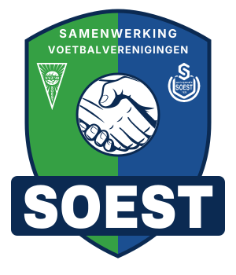

# Huisstijl Samenwerking Voetbalverenigingen Soest

De huisstijl van de samenwerking tussen de Soester voetbalclubs **VVZ'49** en **So Soest**: logo, kleuren, typografie, merkboek en website-componenten. Dit is de basis voor de website.



## Inhoud

| Map | Wat |
| --- | --- |
| [`docs/merkboek.md`](docs/merkboek.md) | Het merkboek: toon, logogebruik, kleur, typografie, ruimte, beeld en iconen. Begin hier. |
| `assets/Logos/` | Het logo (SVG, en PNG van 1024px) en het losse handdruk-beeldmerk. |
| `assets/Clubs/` | De clublogo's van VVZ'49 en So Soest, origineel (PNG) en wit (SVG). |
| `tokens/tokens.json` | Alle design tokens: kleuren (licht en donker thema), typografie, ruimte, afronding en schaduw. |
| `tokens/tokens.css` | Dezelfde tokens als CSS custom properties, plus `@font-face` en tekststijl-classes (`.h2`, `.body`, `.label`…). |
| `fonts/` | Archivo Black en Archivo (woff2, SIL Open Font License). |
| `components/` | React-componenten (`window.SVS`): SiteHeader, SiteFooter, Hero, SectionHeading, Button, Badge, NewsCard, MatchCard, met `bundle.css`, types (`index.d.ts`) en per component een README met gebruiksregels. |
| `examples/index.html` | Een voorbeeldpagina die alles samen laat zien. |

## Kernkleuren

| Token | Licht | Gebruik |
| --- | --- | --- |
| `vvz-groen` | `#35A044` | Groen van VVZ'49, grote vlakken |
| `so-blauw` | `#1B4F91` | Blauw van So Soest, grote vlakken |
| `navy` | `#0B2A52` | Schildrand, SOEST-lint, footer, tekst |
| `groen-actie` | `#1F7A34` | Primaire knoppen en links |
| `blauw-actie` | `#1B4F91` | Secundaire knoppen en links |

Koppen in **Archivo Black**, tekst in **Archivo**.

## Gebruik in een website

```html
<link rel="stylesheet" href="tokens/tokens.css">
<link rel="stylesheet" href="components/bundle.css">
<!-- React 18 (UMD) vóór de bundle -->
<script src="components/bundle.js"></script>
```

Zet `data-theme="dark"` op `<html>` voor het donkere thema; zonder attribuut volgt de site de systeeminstelling.

## Let op

- De handdruk in het logo komt uit een stockbestand. Controleer de licentie voordat het logo definitief wordt vastgesteld of als merk wordt geregistreerd.
- De clublogo's zijn eigendom van VVZ'49 en So Soest.
